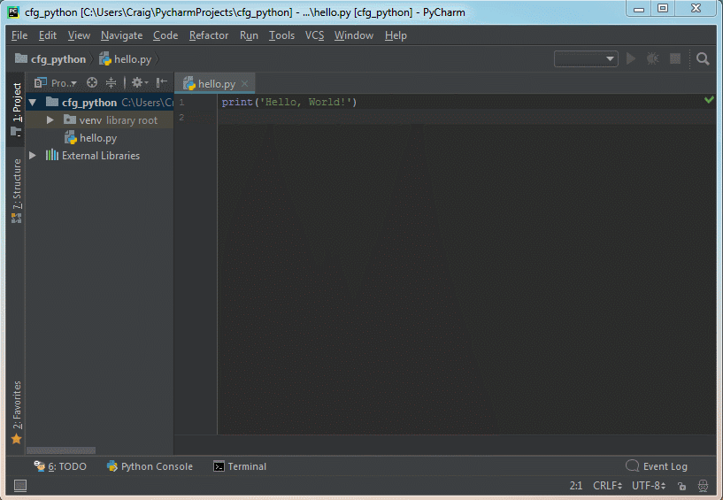
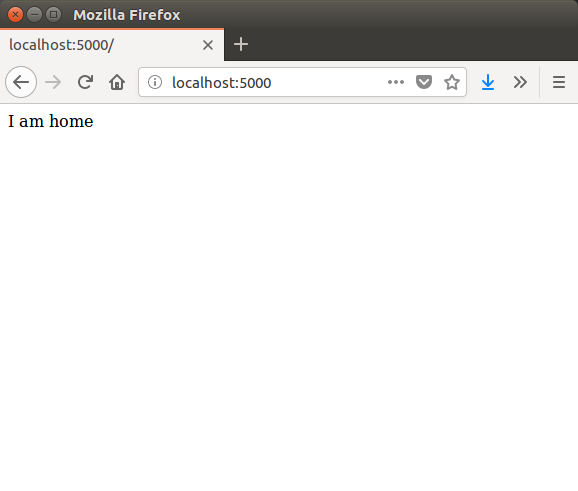

STARTER

---

# Code First: Girls

#### Python Session 2

---

HOMEWORK?

---

This session
1. Importing Python libraries
1. Python pip
1. Flask and Jinja
1. Decorators

---

### Python Libraries

----

**Library/Module:** A collection of reusable code that someone else has written

Python has lots of useful built-in libraries and can be extended with third-party libraries.
----


The built-in turtle module is based on Logo and can be used to draw basic images

``` python
import turtle

turtle.forward(100)
turtle.right(90)

turtle.done()
```

Note: drawing_with_turtle.py

----


----

Imported libraries can be mixed with other Python expressions

``` python

import turtle

for index in range(4):
    turtle.forward(100)
    turtle.right(90)

turtle.done()

```

Note: square_turtle.py

----


----

The built-in random module is used to generate random numbers

``` python
from random import randint

number = randint(1, 10)

print(number)
```

Tip: **Do not** save this program as `random.py`

Note: random_example.py

----

**Task:** Using the **turtle** and **random** modules, draw a spiral with a random angle


----

Solution:

``` python
import turtle
from random import randint

angle = randint(45, 90)

for length in range(200):
    turtle.forward(length)
    turtle.right(angle)

turtle.done()
```
---

### Python Pip

----

**pip:** A package manager used to install libraries that other people have written

----

pip is used via the terminal (command-line)



----

We want to install Flask using pip using the Terminal

``` command-line
pip install flask
```

----

Flask is installed along with the packages it depends on

``` command-line
Successfully installed Jinja2-2.10 MarkupSafe-1.0 Werkzeug-0.14.1 click-6.7 flask-0.12.2 itsdangerous-0.24
```

---

### Flask: Routing

----

**Flask:** A Python library for building programs that run on the web, including websites and APIs.

Flask manages things like routing and rendering templates so that you can focus on writing your application's code.

----

``` python
from flask import Flask
app = Flask(__name__)


@app.route('/')
def home():
    return 'I am home'


app.run(debug=True)
```

Note: flask_home.py

----

After running the Python program, you can view the website at [localhost:5000](http://localhost:5000)

----



----

The `@app.route()` code is a **function decorator**.

It tells Flask to run a function when someone goes to a specific url route

----

This adds [localhost:5000/about/](http://localhost:5000/about/)

``` python
from flask import Flask
app = Flask(__name__)


@app.route('/')
def home():
    return 'I am home'


@app.route('/about/')
def about():
    return 'This is a Flask website'


app.run(debug=True)
```


**Tip:** Remember to include the second forward slash after `'about'`

Note: flask_about.py

----

**Task:** Add each of these routes and make them return the following values

Route | Return
--- | ---
/hello/ | `"Hello"`
/add/2/2/ | 2 + 2

----

Solution

``` python

@app.route('/hello/')
def hello():
    return 'Hello'


@app.route('/add/2/2/')
def add():
    return str(2 + 2)

```

Note: flask_hello_and_add.py

---

### Flask: Dynamic Routes

----

So far our Flask app only has fixed routes

Flask can also handle dynamic routing


----

Change your code for the `'/hello/'` route

``` python
@app.route('/hello/<name>/')
def hello(name):
    return 'Hello {}'.format(name)

```

In the web browser go to

- [http://localhost:5000/hello/kitty/](http://localhost:5000/hello/kitty/)
- [http://localhost:5000/hello/sailor/](http://localhost:5000/hello/sailor/)
- [http://localhost:5000/hello/friend/](http://localhost:5000/hello/friend/)

Note: flask_dynamic_routing

----

``` python
@app.route('/add/<num_1>/<num_2>/')
def add(num_1, num_2):
    result = int(num_1) + int(num_2)
    return str(result)

```

- [http://localhost:5000/add/1/2/](http://localhost:5000/add/1/2/)
- [http://localhost:5000/add/1/2/](http://localhost:5000/add/5/7/)
- [http://localhost:5000/add/1/2/](http://localhost:5000/add/98659/865/)


Note: flask_dynamic_routing.py

----

**Task:** I want to calculate the area of a circle using my Flask app. Use the following code as a starting point

``` python
def circle_area(radius):
    area = 3.14 * (radius ** 2)
    return area
```

For a circle with radius 5, the url should look like this [http://localhost:5000/circle/5/](http://localhost:5000/circle/5/)


----

Solution

``` python
@app.route('/circle/<radius>/')
def circle_area(radius):
    radius = int(radius)
    area = 3.14 * (radius ** 2)

    return str(area)
```

Note: flask_circle.py


----

DO NOT USE `raw_input()` WITH FLASK


---

### Flask: HTML with Jinja

----

---

### Flask: Forms

----

