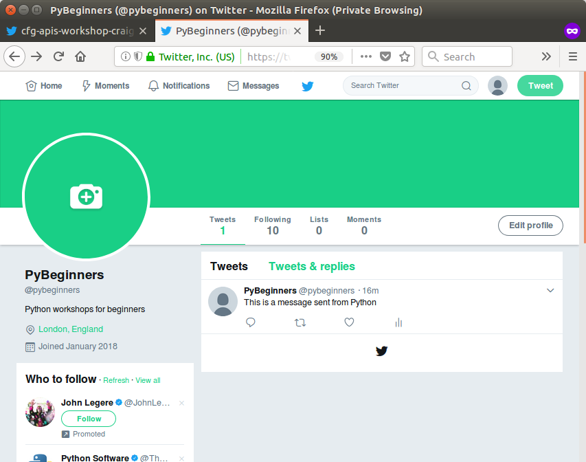

**Task: ** [http://bit.ly/2HoY3HC](http://bit.ly/2HoY3HC)

Also, make sure you have a Twitter account

----

Solution
``` python
from flask import Flask

app = Flask(__name__)


@app.route('/dogs/')
def get_dogs():
    # This should return 'Sheep Dog, German Sherphed, Shiba Inu'
    # However it only returns 'Sheep Dog, '
    # Change the code to correct the output

    dogs = ['Sheep Dog', 'German Sherphed', 'Shiba Inu']

    return_value = ''

    for dog in dogs:
        return_value = return_value + dog + ', '

    return return_value


app.run(debug=True)
```

---

# Code First: Girls

#### Python Session 4

---

This session
1. Dictionary data type
1. Web APIs
1. Getting data with an API
1. Posting data with an API

---

### Dictionary Data Type

----

**Dictionary:** Stores a colleciton of labelled items. Each item has a key and a value

----

``` python
person = {
    'name': 'Jessica',
    'age': 23,
    'height': 172
}
```

----

Values in a dictionary are accessed using their keys
``` python
person = {
    'name': 'Jessica',
    'age': 23,
    'height': 172
}

print(person['name'])
```

----

**Task:** Print the values of `name`, `post_code` and `street_number` from the dictionary

``` python
place = {
    'name': 'The Anchor',
    'post_code': 'E14 6HY',
    'street_number': '54',
    'location': {
        'longitude': 127,
        'latitude': 63,
    }
}
```

**Extension:** Print the values of `` and `` from the inner dictionary

----

Solution

``` python
place = {
    'name': 'The Anchor',
    'post_code': 'E14 6HY',
    'street_number': '54',
    'location': {
        'longitude': 127,
        'latitude': 63,
    }
}

print(place['name'])
print(place['post_code'])
print(place['street_number'])
```

----

``` python
print(place['location']['longitude'])
print(place['location']['latitude'])


location = place['location']

print(location['longitude'])
print(location['latitude'])
```

----

Putting dictionaries inside a list is very common

``` python
people = [
    {'name': 'Jessica', 'age': 23},
    {'name': 'Trisha':, 'age': 24},
]

for person in people:
    print(person['name'])
    print(person['age'])
```

----

**Task:** Using a for loop, output the values `name`, `colour` and `price` of each dictionary in the list

``` python
fruits = [
    {'name': 'apple', 'colour': 'red', 'price': 0.12},
    {'name': 'banana', 'colour': 'yellow': 'price': 0.2},
    {'name': 'pear', 'colour': 'green': 'price': 0.19},
]
```

---

### APIs: Reading Stuff

----

**Application Programming Interface (API):** A way to interact with another application from your code through requests.

Web APIs allow you to do this over the internet.

----

Pokéapi is an API to get data about Pokémon

[pokeapi.co/](https://pokeapi.co/)

----

You can retrieve information about different Pokemon from urls

[https://pokeapi.co/api/v2/pokemon/6/](https://pokeapi.co/api/v2/pokemon/6/)

----

Install the `requests` library using pip

``` command-line
pip install requests
```

----

Save this as `get_pokemon.py`

``` python
import requests

url = 'https://pokeapi.co/api/v2/pokemon/151/'

response = requests.get(url)
print(response)

pokemon = response.json()
print(pokemon['name'])
```

Outputs
``` command-line
<Response [200]>
mew
```

Note: get_pokemon.py

----

Reponse status codes:

Status Code | Name | Explanation
--- | --- | ---
200 | OK | The request worked
404 | Not found | Couldn't find the url you requested
400 | Bad request | The request you made isn't understood


----

**Task:** Get the *height* and *height* of the Pokemon and print the output

Add `raw_input()` to choose which Pokemon you want information about

----

Solution

``` python
import requests

pokemon_number = raw_input("What is the Pokemon's ID? ")

url = 'https://pokeapi.co/api/v2/pokemon/{}/'.format(pokemon_number)

response = requests.get(url)
pokemon = response.json()

print(pokemon['name'])
print(pokemon['height'])
print(pokemon['weight'])
```

Note: get_pokemon_height.py

---

### APIs: Sending Stuff

----


Go to [apps.twitter.com/](https://apps.twitter.com/) and log in

----


----


----

After creating the app, on the Keys and Access Tokens tab, click the Generate Access Token button

----
The `tweepy` library is a quick way to use Twitter's API

``` command-line
pip install tweepy
```

----

``` python
import tweepy

consumer_key = 'XXXX'
consumer_secret = 'XXXX'

access_key = 'XXXX'
access_secret = 'XXXX'

auth = tweepy.OAuthHandler(consumer_key, consumer_secret)
auth.set_access_token(access_key, access_secret)

api = tweepy.API(auth)
api.update_status('This is a message sent from Python')
```

----




---

### Recap

----

This session
1. Dictionary data type
1. Web APIs
1. Getting data with an API
1. Posting data with an API

---

Homework

Set up a Github account

---
