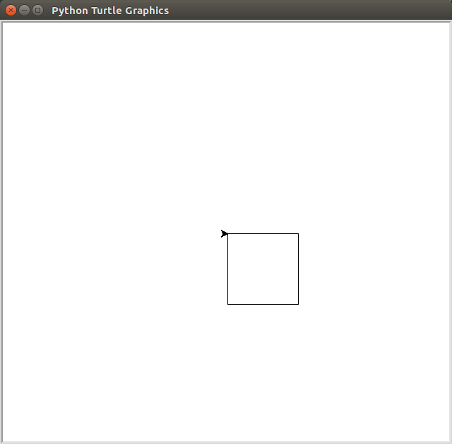

**Task:** Go to this url

[http://bit.ly/2D4YuEx](http://bit.ly/2D4YuEx)

Copy and fix the code with a partner

----

Solution
``` python
my_routine = ['wake up', 'shower', 'get the train', 'work', 'go home', 'eat', 'sleep']

days = ['mon', 'tues', 'wed', 'thurs', 'fri']

for day in days:
    print('Today is {}'.format(day))
    print('I need to')

    for item in my_routine:
        print(item)

    print('')
```


---

# Code First: Girls

#### Python Session 3

---

Session 4 in the course guide

Course guide content will be covered in Session 5

---

This session:
1. Logical Operators
1. If Statements
1. Importing Python libraries

---

### Logical Operators

----

**Logical Operators:** used to check if an expression is `True` or `False`

----

This code checks if the user has input `'Monday'` using the `==` operator

``` python
today = input('What day is it? ')

is_monday = today == 'Monday'

print('Today is Monday: {}'.format(is_monday))
```

----

Operators in Python

Name | Python
---|---
Equal to | `==`
Not equal | `!=`
Greater than | `>`
Less than | `<`
Greater than or equal | `>=`
Less than or equal | `<=`

----

This code checks if today is not Monday
``` python
today = input('What day is it? ')

is_not_monday = today != 'Monday'

print('Today is not Monday: {}'.format(is_not_monday))
```

----

**Task:** You have a budget of £10 and want to write a program to decide which burger restaurant to go to.

1. Input the `price` of a burger using `input()`
1. Check whether the `price` is less than or equal (`<=`) `10.00`
1. Print the result in the format below

``` command-line
Burger is within budget: True
```

**Hint:** remember to convert the input from a string to a decimal with `float()`

----


Answer

``` python
price = input('How much is a burger? ')

within_budget = float(price) <= 10.00

print('Burger is within budget: {}'.format(within_budget))

```

----

There are operators to combine multiple checks

Python | What it does
---|---
and | both expressions are `True`
or | at least one expression is `True`
not | reverse the expression (`True` becomes `False` and vice-versa)

----

``` python
today = input('What day is it? ')
sunny = input('Is it sunny? (y/n)')

is_weekend = today == 'Saturday' or today == 'Sunday'
is_sunny = sunny == 'y'

is_beach_good_idea = is_weekend and is_sunny

print('You should go to the beach: {}'.format(is_beach_good_idea))
```
----

**Task:** Add code to your burger program to input whether the restaurant has a vegetarian option

The output should say whether the cost is within budget **AND** has a vegetarian option

``` command-line
Restaurant meets criteria: True
```

----

``` python
price = input('How much is a burger? ')
vegetarian = input('Is there a vegetarian option? (y/n) ')

within_budget = float(price) <= 10.00
has_vegetarian = vegetarian == 'y'

is_good_choice = within_budget and has_vegetarian

print('Restaurant meets criteria: {}'.format(is_good_choice))
```

---

### If Statements

----

**if statement:** used to run a block of code depending on whether a condition is `True` or `False`

----

``` python
password = input('password: ')

if password == 'jumanji':
    print('Success!')

```

----

An `if` statement has the following:
1. The `if` keyword
1. A condition (logical operator expression)
1. A colon
1. Body (indented four spaces)

----

``` python
name = input("What is your name? ")
password = input("What is your password? ")

is_admin = name == 'admin'
is_password_correct = password == 'dinosaurs'

if is_admin and is_password_correct:
    print('Welcome')

if not is_admin or not is_password_correct:
    print('Go away')
```

----

**Task:** Rewrite the output of your burger program to use if statements

For example:

``` command-line
This restaurant is a great choice!
```

OR

``` command-line
Probably not a good idea
```

----

**else statement:** Used with an `if` statement and will run when the `if` condition is `False`


----

``` python
password = input('password: ')

if password == 'jumanji':
    print('Success!')
else:
    print('Fail!')

```

----

``` python

today = input('What day is it? ')
raining = input('Is it sunny? (y/n)')

is_weekend = today == 'Saturday' or today == 'Sunday'
is_raining = raining == 'y'

is_beach_good_idea = is_weekend and not is_raining

if is_beach_good_idea:
    print('You should go to the beach today!')
else:
    print('Don't go to the beach today')


```

---

### Python Libraries

----

**Library/Module:** A collection of reusable code that someone else has written

Python has lots of useful built-in libraries and can be extended with third-party libraries.
----


The built-in turtle module is based on Logo and can be used to draw basic images

``` python
import turtle

turtle.forward(100)
turtle.right(90)

turtle.done()
```

**Tip:** Do not save this file as `turtle.py`

Note: drawing_with_turtle.py

----


----

Imported libraries can be mixed with other Python expressions

``` python

import turtle

for index in range(4):
    turtle.forward(100)
    turtle.right(90)

turtle.done()

```

Note: square_turtle.py

----



----

The built-in random module is used to generate random numbers

``` python
from random import randint

number = randint(1, 10)

print(number)
```

Tip: **Do not** save this program as `random.py`

Note: random_example.py

----

**Task:** Using the **turtle** and **random** modules, draw a spiral with a random angle


----

Solution:

``` python
import turtle
from random import randint

angle = randint(45, 90)

for length in range(200):
    turtle.forward(length)
    turtle.right(angle)

turtle.done()
```
---

